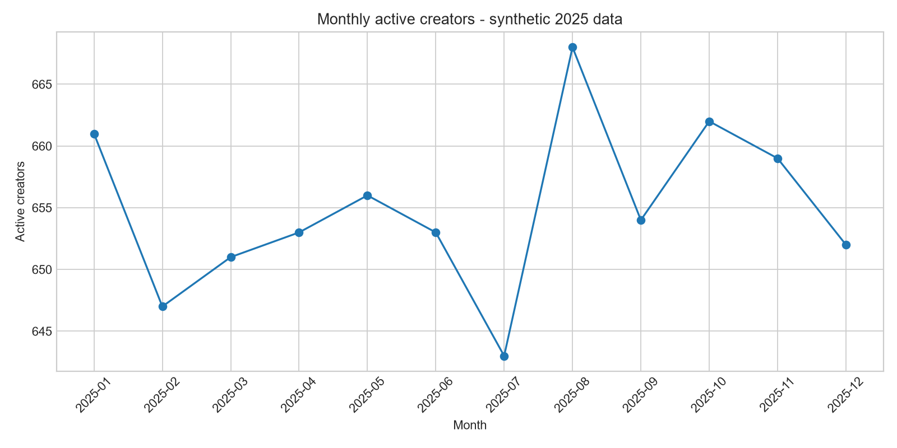
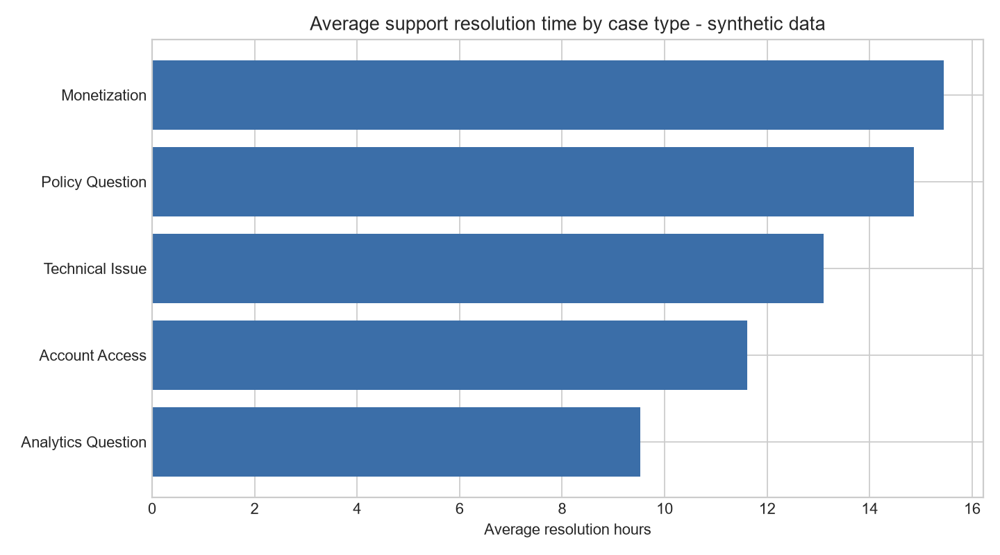

# Creator Performance and Partner Support Analysis

## Overview

This repository analyzes creator activity, audience growth, and partner-support operations across a one-year period. The analysis combines creator attributes, monthly performance, and support-case history to identify differences across partner tiers and areas that merit operational review.

The dataset is synthetic. It does not contain information from YouTube, Google, or any other company, and the findings do not represent actual platform performance.

## Questions

- How stable is monthly creator activity?
- Which partner tiers have the strongest year-end retention and audience growth?
- Where is support demand concentrated?
- Which support case types take the longest to resolve?
- Is creator-level support volume associated with view growth?

## Data

The analysis uses three related tables covering January through December 2025:

| Table | Grain | Records | Selected fields |
|---|---|---:|---|
| `creators` | One row per creator | 750 | Region, category, partner tier, join date |
| `monthly_performance` | One row per creator per month | 9,000 | Uploads, views, watch hours, new subscribers |
| `support_cases` | One row per support case | 2,076 | Case type, channel, resolution time, first-contact resolution, satisfaction |

`creator_id` connects creator attributes to the monthly performance and support tables. All records are produced with a fixed random seed so the analysis can be reproduced.

## Methods

- **SQL / SQLite:** schema design, joins, common table expressions, aggregations, and retention calculations
- **Python / pandas:** synthetic data creation, quality checks, KPI summaries, and charts
- **R:** grouped analysis and visualization with `dplyr` and `ggplot2`

The principal metrics are defined as follows:

| Metric | Definition |
|---|---|
| Active creator | Creator with at least one upload during the month |
| Monthly active creators | Distinct active creators during the month |
| View growth | Percentage change from average first-half monthly views to average second-half monthly views |
| Year-end active retention | January-active creators who were also active in December, divided by January-active creators |
| Cases per 100 creators | Support cases divided by creators in the segment, multiplied by 100 |
| First-contact resolution | Closed cases resolved on the first contact, divided by all closed cases |

## Findings

- Monthly active creators remained within a narrow range of **643 to 668**.
- Established creators had the highest year-end active retention at **94.3%**, followed by Growth at **89.6%** and Emerging at **82.0%**.
- Growth creators recorded the highest median view growth at **18.5%**; Emerging creators reached **10.2%**, and Established creators reached **6.6%**.
- Emerging creators generated **329.7 support cases per 100 creators**, compared with **236.2** for Growth and **165.7** for Established creators.
- Monetization cases had the longest average resolution time at **15.4 hours**. Analytics questions had the shortest average resolution time at **9.5 hours**, but the lowest first-contact resolution rate at **62.3%**.
- Creator-level support volume and view growth had almost no linear relationship in this dataset (`r = 0.028`). This descriptive result does not indicate that support activity caused changes in performance.





## Repository contents

```text
creator-performance-partner-support/
|-- analysis/
|   `-- creator_support_analysis.Rmd
|-- data/
|   |-- raw/
|   `-- processed/
|-- reports/
|   `-- executive_summary.md
|-- sql/
|   |-- 01_schema.sql
|   `-- 02_analysis_queries.sql
|-- src/
|   |-- generate_data.py
|   `-- analyze.py
|-- tests/
|   `-- test_data_quality.py
|-- tools/
|   `-- validate_project.py
|-- LICENSE
`-- requirements.txt
```

## Reproducing the analysis

Python 3.10 or later is recommended.

```bash
python -m venv .venv
```

Activate the environment on Windows:

```powershell
.venv\Scripts\Activate.ps1
```

On macOS or Linux:

```bash
source .venv/bin/activate
```

Install the packages and run the workflow:

```bash
pip install -r requirements.txt
python src/generate_data.py
python src/analyze.py
pytest
python tools/validate_project.py
```

To run the R analysis, open `analysis/creator_support_analysis.Rmd` in RStudio and select **Knit**. The notebook requires `dplyr`, `ggplot2`, and `knitr`.

## Limitations

The data is synthetic and the analysis is observational. It does not include randomized program assignment, support costs, creator lifetime value, or real business outcomes. Segment differences may also reflect creator size, category, tenure, or other factors not isolated in this analysis. The findings are suitable for demonstrating the analytical workflow, not for estimating causal impact or program return on investment.

## License

This project is available under the MIT License.
